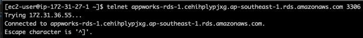

# 🌐 Remote Learning Assignment - Week 1

Hi everyone, welcome to the first part of Campus Program. In this three weeks, we'll learn about how to build & launch our first webapp. So let's get started!

## 📌 Assignment 1: Build infrastructure on Amazon Web Service (AWS)

At first, we'll need to prepare infrastructure on AWS. Here's some official documents:

- [Tutorial: Get started with Amazon EC2 Linux instances](https://docs.aws.amazon.com/AWSEC2/latest/UserGuide/EC2_GetStarted.html)
- [Elastic IP addresses](https://docs.aws.amazon.com/AWSEC2/latest/UserGuide/elastic-ip-addresses-eip.html)
- [Amazon EC2 security groups for Linux instances](https://docs.aws.amazon.com/AWSEC2/latest/UserGuide/ec2-security-groups.html)
- [Security group rules for different use cases](https://docs.aws.amazon.com/AWSEC2/latest/UserGuide/security-group-rules-reference.html)
- [Creating a MySQL DB instance and connecting to a database on a MySQL DB instance](https://docs.aws.amazon.com/AmazonRDS/latest/UserGuide/CHAP_GettingStarted.CreatingConnecting.MySQL.html)

### 🏗️ Create AWS resources

Refer to ducuments above, we'll need to prepare one `EC2` instance and one `RDS` Database with following spec:

- EC2 (free tier plan)
  - OS Images: `Amazon Linux 2023 AMI` or `Ubuntu Server 22.04 LTS`
  - Instance type: `t2.micro`
  - Storage size: `8 GiB`

- RDS (free tier plan)
  - Engine type: `MySQL 8.0.28`
  - Instance type: `db.t4g.micro`
  - Storage size: `20 GiB`

### 🖥️ Associate Elastic IP

Associate Elastic IP with EC2 instance to avoid IP changing when instance reboot.

### 🛢️Ensure RDS database connection

Try to modify `Security group` settings until we can connect database from outside.

Examples:

- EC2 -> RDS (using `telnet`)



- PC -> RDS (using `dbeaver`)


> 💸 **NOTICE:** Be careful about the [AWS free tier limit](https://aws.amazon.com/tw/free/?all-free-tier.sort-by=item.additionalFields.SortRank&all-free-tier.sort-order=asc&awsf.Free%20Tier%20Types=*all&awsf.Free%20Tier%20Categories=*all), it may incur extra costs.

## 📌 Assignment 2: Create Github repository

And then, let's prepare a repository for our first project

1. Create a new repository named `remote-assignments` in our GitHub account
2. Create a new branch named `dev`. (**All changes will be commited into this branch first**)
3. Create file `README.md` with following titles:
    - Description
    - Environment requirements
    - How to use
> NOTICE: The quality of README.md is very important. It's the entry a person will see and understand what the project does. So keep it up-to-date when our repository changed anytime.

## 📌 Assignment 3: Synchronous vs. Asynchronous Function

Basically, there are three ways to implement the asynchronous function:

1. callback
2. promise
3. async / await

But what's the difference beween a synchronous and an asynchronous function?  
Let's do an experiment and see what happended.

**Requirements:**

1. Create 2 files by the templates below: requestSync.js and requestAsync.js
2. Write function to request synchronously / asynchronously
3. Print out the execution time(ms) of each function call 
   Optional: you can try to get the response body, and use the timestamp in it as the end time directly.
4. Monitor the total execution time of the 2 files
5. Take a screenshot of each in step 4. and put them in PR description  
    e.g.
    
6. Answer the questions below in PR description  
    * Based on the result of experiment, what's the differences of sync/async functions we can tell?
    * In which types of situations are asynchronous functions most useful?
    * We've known the 3 ways to implement async functions, how do we choose from them and what are their pros and cons?
    * Any other observations

**Note:** It's free to use any third party modules, but you need to describe why to use it in PR description

```javascript
// requestSync.js

const url = "https://ec2-54-64-246-136.ap-northeast-1.compute.amazonaws.com/delay-clock";

function requestSync(url) {
    // write code to request url synchronously
}
requestSync(url) // would print out the execution time
requestSync(url)
requestSync(url)
```

```javascript
// requestAsync.js

const url = "https://ec2-54-64-246-136.ap-northeast-1.compute.amazonaws.com/delay-clock";

function requestCallback(url, callback) {
    // write code to request url asynchronously
}

function requestPromise(url) {
    // write code to request url asynchronously with Promise
}

async function requestAsyncAwait(url) {
    // write code to request url asynchronously
    // you should call requestPromise here and get the result using async/await.
}

requestCallback(url, console.log); // would print out the execution time
requestPromise(url).then(console.log);
requestAsyncAwait(url);
```

## ❓ Understanding Check

1. How do you make sure that you can connect into your RDS? And please post the successfully connected screen shot.
2. Without Elastic IP, if we stop the EC2 instance and start it again, would the IP address change? Why?
3. What's the purpose of using Elastic IP?

You need to answer the quesions above in the PR description (including the observation in the Assignment 3).

## 📤 Submission Guidelines

1. Save changes to the `dev` branch. Use this commit message format:
   ```
   # e.g. remote-week1: initial commit
   remote-week<week number>: <commit description>
   ```  
   > 🚫 **NOTICE:** Incorrect commit messages won't be accepted.

2. Create a pull request from `dev` to `main`. Include:
   - Elastic IP address
   - Database name
   - Change summary
   - Pull request will like this: 

1. Bravo! 🎉 Having wrapped up this week's tasks, alert your mentor for a review of your GitHub repository.