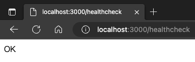
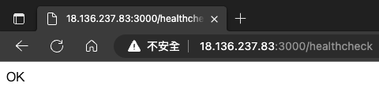

# 🌐 Remote Learning Assignment - Week 2

## 📌 Assignment 1: The first backend service

Now, let's start to create our first backend service by using [Express.js](https://expressjs.com/).

### Build web service

Follow the [official tutorials](https://expressjs.com/en/starter/installing.html) to build our first web service, and create the first API named `/healthcheck` as follow:



> NOTICE: `Healthcheck API` (or `Ping API`) is very useful for service monitoring. So remember to add it in every web project we created.

### Push to github

Commit our code into `dev` branch without `node_modules` folder. (using `.gitignore`)

### Deploy to EC2 instance

Deploy our code to EC2 instance and run it, modify `Security group` and check the result with our `Elastic IP` address as follow:



**Hint:** How do we run a node.js app in background?

## 📌 Assignment 2: Create MySQL Database and Table

As a backend engineer, our task now is to create a new database and a table in our RDS database that we set up last week.

Connect to MySQL server from command line or GUI interface. Create a database named `assignment` and a `user` table which includes columns below:

| Field | Description |
| :---: | :---: |
| id     | the member id in the site| 
| name     | username |
| email     | email addres also seen as the account id|
| password    | self-explanatory XD |
| created_at | the timestamp when the user signed up |

**Note:** In this assignment, you need to hand in an additional data file in SQL format (the
file name is `backup.sql`) by [mysqldump tool](https://dev.mysql.com/doc/refman/8.0/en/mysqldump-sql-format.html).

## 📌 Assignment 3: Complete Admin APIs

As a backend engineer, our task now is to complete user related APIs for the administration.

Use [mysql2](https://www.npmjs.com/package/mysql2) to connect to our database we created previously and [express](https://www.npmjs.com/package/express) as the framework.

Refer to the API document, we should complete APIs listed below:

* User Sign Up API
    Get the request data and insert data (with the proper schema) into our database.
* User Qeury API
    Get the request data and select matched data from our database.

Please note that we need to do some data validation for the users' input. [Regular expression](https://developer.mozilla.org/en-US/docs/Web/JavaScript/Guide/Regular_Expressions) may help.

**Note**: As with Assignment-2, please deploy our code to EC2 instance.

### Input Requirement

| Field | Requirement |
| :---: | :---: |
| name |  can only contains english alphabet and number |
| email | with the right email format |
| password | see below |

Passwords should contain at least three of the four character types:

* Uppercase letters: A-Z.
* Lowercase letters: a-z.
* Numbers: 0-9.
* Symbols: ~`! @#$%^&*()_-+={[}]|\:;"'<,>.?/|

## 📄 API Document

### Response Object

* `User Object`

    | Field | Type | Description |
    | :---: | :---: | :--- |
    | id | Number | User's id. |
    | name | String | User's name. |
    | email | String | User's email. |

### User Sign Up API

* **End Point:** `/users`

* **Method:** `POST`

* **Request Headers:**

    | Field | Type | Description |
    | :---: | :---: | :---: |
    | Content-Type | String | Only accept `application/json`. |
    | Request-Date | String | Current datetime with [format requirement](https://www.rfc-editor.org/rfc/rfc2616#section-3.3) |

* **Request Body**

    | Field | Type | Description |
    | :---: | :---: | :---: |
    | name | String | Required |
    | email | String | Required |
    | password | String | Required |

* **Request Body Example:**

    ```
    {
      "name":"Addie",
      "email":"addie@appworks.tw",
      "password":"test_123"
    }
    ```

* **Success Response: 200**

    | Field | Type | Description |
    | :---: | :---: | :--- |
    | user | `User Object` | User information |
    | request-date | String | `Request-Date` field in request header |

* **Success Response Example:**

    ```
    {
        "data": {
            "user": {
                "id": 8787,
                "name": "Addie",
                "email": "addie@appworks.tw",
              },
            "request-date": "Tue, 10 Jan 2023 00:43:21 GMT"
          }
    }
    ```

* **Email Already Exists: 409**

    | Field | Type | Description |
    | :---: | :---: | :--- |
    | error | String | Error message. |

* **Client Error Response: 400**

    | Field | Type | Description |
    | :---: | :---: | :--- |
    | error | String | Error message. |

### User Query API

* **End Point:** `/users`

* **Method:** `GET`

* **Query Parameters**

    | Field | Type | Description |
    | :---: | :---: | :--- |
    | id | Number | User Id. |

* **Request Headers:**
    | Field | Type | Description |
    | :---: | :---: | :---: |
    | Content-Type | String | Only accept `application/json`. |
    | Request-Date | String | Current datetime with [format requirement](https://www.rfc-editor.org/rfc/rfc2616#section-3.3) |

* **Success Response: 200**

    | Field | Type | Description |
    | :---: | :---: | :--- |
    | user | `User Object` | User information |
    | request-date | String | `Request-Date` field in request header |

* **Success Response Example:**

    ```
    {
        "data": {
            "user": {
                "id": 8787,
                "name": "Addie",
                "email": "addie@appworks.tw",
              },
            "request-date": "Tue, 10 Jan 2023 00:43:21 GMT"
          }
    }
    ```

* **User Not Existing: 403**

    | Field | Type | Description |
    | :---: | :---: | :--- |
    | error | String | Error message. |

* **Client Error Response: 400**

    | Field | Type | Description |
    | :---: | :---: | :--- |
    | error | String | Error message. |

### 📌 Advanced Optional
The website url we visit in our daily life is **NOT** with the port number. How could we do this?

**Hint:** What is the default port number of HTTP/HTTPS?

## ❓ Understanding Check

1. How did you design the user table schema? Why?
2. What does the `status code` mean? Is it a must to use?
3. How and what tools did you use to test your APIs?
4. How and what tools did you use to make sure the app would not shut down even if you exit the ssh connection?
5. What are the interactions between `client`, `firewall`, `EC2` and `RDS` when you send a request to you app server and get the response? You can use sequence diagram to describe it more clearly.
6. (advanced optional) What did you do to make clients access your APIs without the certain port number?
7. (advanced optional) Compare to the application server, what's the web server?

You need to answer the quesions above in the PR description.

## 📤 Submission Guidelines

1. Save changes to the `dev` branch. Use this commit message format:
   ```
   # e.g. remote-week1: initial commit
   remote-week<week number>: <commit description>
   ```  
   > 🚫 **NOTICE:** Incorrect commit messages won't be accepted.

2. Create a pull request from `dev` to `main`. Include:
   - Elastic IP address
   - Database name
   - Change summary

3. Bravo! 🎉 Having wrapped up this week's tasks, alert your mentor for a review of your GitHub repository.

## 💡 Recap

1. How can others know your dependencies if we don't upload the `node_modules`? What's the differences between devDependencies and dependencies?
2. Is it safe to commit the database password to GitHub? How should we keep the confidential and sensitive data？
3. Could we save the users' passwords by plain code? How should we store users' passwords safely in the database?
