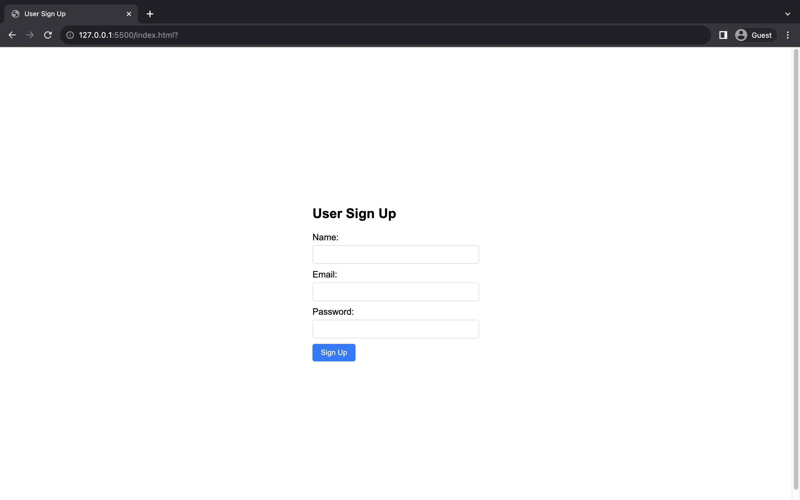

# 🌐 Remote Learning Assignment - Week 3

## 📌 Assignment 1: Create a Signup Page using HTML, CSS, and JavaScript

Have you completed the tutorial on Treehouse? Or are you already familiar with HTML, CSS, and JavaScript? Let's put your skills to the test and create a simple signup page:

* Password inputs should be masked to enhance security.
* All input fields are mandatory. The email input, in particular, should be validated to ensure it follows the correct format.
* When the "Sign Up" button is clicked, the system should call the "User Sign Up API" (which we developed in our previous assignment). The API's response will be alerted to the user.
* The response should display the id, name, and email in an alert box.
* If an email is registered that has already been used, an alert should display the message "Email already exists" along with an HTTP 409 error code.
* The front-end page design should closely follow the example provided by us.

> 💸 **Note:** Ensure that every API request made adheres to the specifications provided in the API documentation from our previous assignment.

## 📌 Assignment 2: Deploy to EC2 instance with static files using Nginx

Since our signup page has been designed using HTML, CSS, and JavaScript, it can be deployed as static files. We'll be utilizing Nginx, a powerful web server, to serve these static files.

### 1. Create a Production Build of Your Static Files:
* Ensure all your static files - HTML, CSS, and JavaScript - are ready for deployment.

### 2. Set Up Nginx:

* Deploying the frontend and backend on the same EC2 instance necessitates the creation of a single entry point. Nginx is perfect for this task.
* Install Nginx on your EC2 instance.

### 3. Configure Nginx for Static Files and Backend Service:
* Dive into the [Serving Static Content](https://docs.nginx.com/nginx/admin-guide/web-server/serving-static-content/) and [Configuring NGINX and NGINX Plus as a Web Server](https://docs.nginx.com/nginx/admin-guide/web-server/web-server/) guides to grasp the nuances.
* Create or modify the Nginx config file to set up location proxies as follows:
    * Listen on port 80.
    * Direct traffic from the root path `/` to the frontend static files.
    * Direct traffic from `/api/` to the backend service.

### 4. Reload and Test:
* After updating, reload Nginx to apply the changes.
* Go to `/` in your browser to see your frontend page.
* If you have one set up, `/api/healthcheck` should show the backend service response.

## ❓ Understanding Check

Please answer the following questions and include them in your assignment report:

* What are the roles of HTML, CSS, and JavaScript in web development? How do they interact and function together?
* How can you validate the format of content in input fields, such as email and password?
* What is Nginx? Why is it used for deploying static websites?
* Apart from serving static content, what other functionalities can Nginx provide?
* How did you set up Nginx in your deployment process? What configurations did you add, and what is their significance? 

## 🌟 Advanced Tasks (Optional)

React is a powerful JavaScript library used for building user interfaces. With React, you can create interactive UIs that update efficiently and are easy to build.
* To dive into React, start with the [Create React App - Getting Started guide](https://create-react-app.dev/docs/getting-started). It offers a comprehensive introduction to setting up a new React project.
* For a hands-on learning experience, follow the [React Tutorial](https://reactjs.org/tutorial/tutorial.html). This tutorial will walk you through building a game and, in the process, introduce you to essential React concepts.
* As a challenge, try refactoring the signup page you previously built, leveraging the insights and techniques you've gleaned from the above resources.

## 📤 Submission Guidelines

1. Save changes to the `dev` branch. Use this commit message format:
- All changes made to the backend server.
- Frontend web pages are placed in the `static` file folder, including `index.html`, `script.js`, and `styles.css`.
   > 🚫 **NOTICE:** Incorrect commit messages won't be accepted.
2. Create a pull request from `dev` to `main`. Include:
- Elastic IP address
- Database name
- Change summary
- Understanding Check

3. Bravo! 🎉 Having wrapped up this week's tasks, alert your mentor for a review of your GitHub repository.