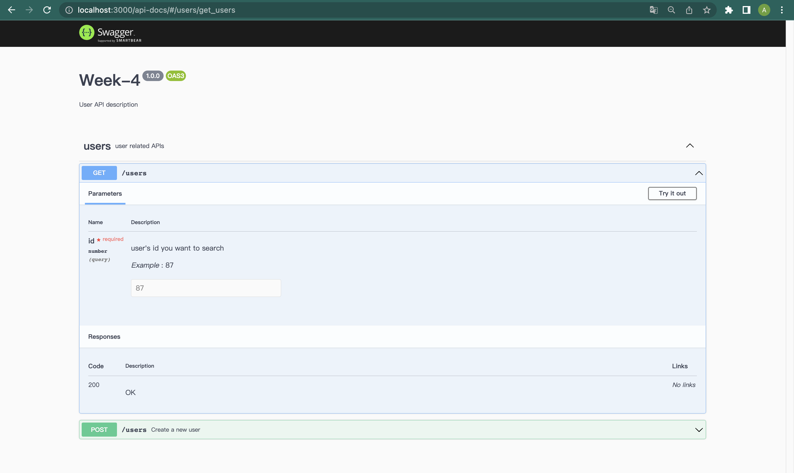
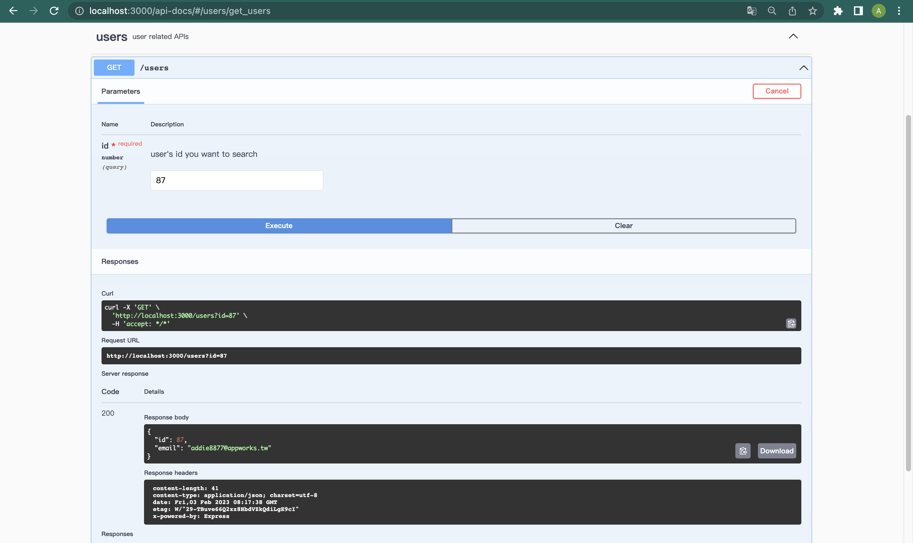
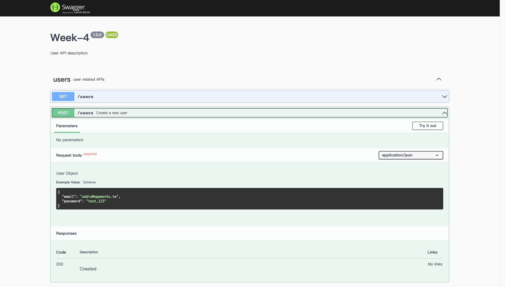

# Week 1 - Part 1

## Overview of What We Should Complete This Week

### Complete RESTful APIs for Products

Refer to [Stylish UI](https://www.figma.com/file/sKhc4A0Gi427u1I5leT5ug/STYLiSH) and [API-Doc](../README.md), you should complete APIs listed below:

Based on your design of data schema. It's your job to create appropriate tables in MySQL server to support all the APIs.

* **Product APIs.**
  * Product Create API.
  * Product List API.
  * Product Search API.
  * Product Details API.
  
### Prepare API Document

APIs are the way to communicate between back-end and frond-end, which you have already learned in the past few weeks.  
In practical, you will collaborate with others which makes the API spec important.  
From now on, you need to maintain your own API document simply by [swagger](https://swagger.io/docs/specification/about/) and [swagger-ui](https://www.npmjs.com/package/swagger-ui).

Example pages:

## Today's Focus

For the mockdata, you need to create a database named `stylish` and define the table schemas align with the [response object](../README.md#response-object).

### Build Product Create API for Management

Sometimes, you have to build API for internal use. It's now the time :) !
You need to parse the products data (which may be like [Products Object](../README.md#response-object)) in the form from clients and find a way to handle both text input and file uploading (e.g. `images`).

Use [multer module](https://github.com/expressjs/multer) to handle file uploading.

**Hint:**

1. What fields would be in the form and should be handled?
2. What's the proper `Content-Type` in the request headers?

### Prepare API Document for Current APIs

Use [swagger](https://swagger.io/docs/specification/about/) and [swagger-ui](https://www.npmjs.com/package/swagger-ui) to build the api-docs page of above 2 APIs.  
Please note that you need to write down the proper config including, but not limited to `parameters`(with example), `requestBody`(with example) and `responses`.

## Advanced Optional

### Run your app on port 80 (highly recommended)
We've discussed the default port number of both HTTP and HTTPS. Try to let the app server run on the port 80 via [nginx](https://nginx.org/en/docs/beginners_guide.html) or any other web server.

### S3
When user upload an image file, you can store it on [AWS Simple Storage Service (S3)](https://aws.amazon.com/tw/s3/). It's a good place to store large files.

## 💡 Recap
1. How did you design the product table? Why? 
   It's recommended to show the schema by [Entity Relationship Diagram (ERD)](https://www.visual-paradigm.com/guide/data-modeling/what-is-entity-relationship-diagram/)
2. What is database normalization? How did you do to implement it?
3. What is RESTful API? What does it for?
4. What does the API doc and the API version for?
5. What is reverse proxy?
