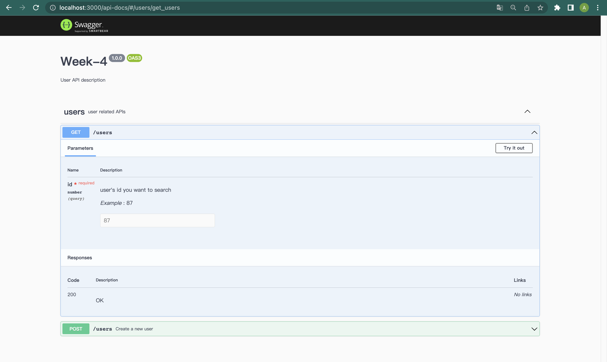
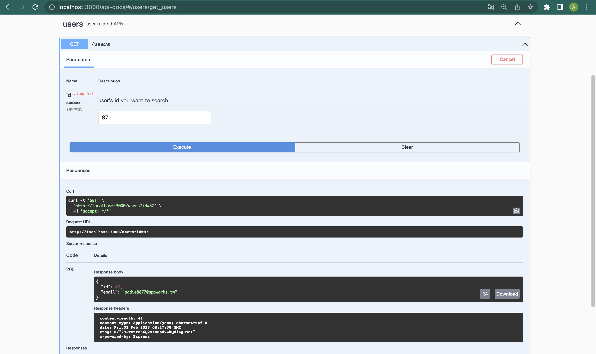
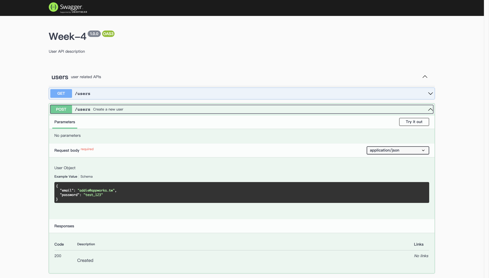

# Week 1 - Part 2

## Overview of What We Should Complete This Week

### Complete RESTful APIs for Products

Refer to [Stylish UI](https://www.figma.com/file/sKhc4A0Gi427u1I5leT5ug/STYLiSH) and [API-Doc](../README.md), you should complete APIs listed below:

Based on your design of data schema. It's your job to create appropriate tables in MySQL server to support all the APIs.

* **Product APIs.**
  * Product Create API.
  * Product List API.
  * Product Search API.
  * Product Details API.
  
### Prepare API Document

APIs are the way to communicate between back-end and frond-end, which you have already learned in the past few weeks.  
In practical, you will collaborate with others which makes the API spec important.  
From now on, you need to maintain your own API document simply by [swagger](https://swagger.io/docs/specification/about/) and [swagger-ui](https://www.npmjs.com/package/swagger-ui).

Example pages:

## Today's Focus

### Build Product List API

Refer to [Stylish UI](https://www.figma.com/file/sKhc4A0Gi427u1I5leT5ug/STYLiSH), build this API for front-end.

**Note:**

1. The first page is page `0`, so the `next_paging` number in the response of products API should be `1` (if needed) when there is no `paging` number given in the request url.
2. If there are no more pages, server won't return next_paging parameter.
3. The page size should be `6`, that is, there should be 6 products in each page.
4. Please create at least `1` products for each category. (categories: `men`, `women`, `accessories`, `all`)
5. Please create more than `6` products in `women` category, that is, it should return at least `1` product from API: `http:/[HOST_NAME]/api/[API_VERSION]/products/women?paging=1`.
6. Please **don't** create more then `150` products (25 pages) in `all` category.

### Build Product Search API

Refer to [Stylish UI](https://www.figma.com/file/sKhc4A0Gi427u1I5leT5ug/STYLiSH), build this API for front-end.

**Note:**

1. We only search the `title` column in product search API and see if part of the `title` match the keyword. For example, products with title "厚實毛呢格子外套" should be found out by keyword "格子" or "厚實".
2. Please create more than `1` products with keyword `洋裝`, that is, it should return at least `2` product from API: `http:/[HOST_NAME]/api/[API_VERSION]/products/search?keyword=洋裝`.

### Build Product Details API

Refer to [Stylish UI](https://www.figma.com/file/sKhc4A0Gi427u1I5leT5ug/STYLiSH) and [API-Doc](../README.md), build this API for front-end.

## Advanced Optional

### Cache
   Cache mechanism is very suitable for rarely updating data. For example, our Detail API usually response the same data to the front-end (except for the variants). If we store data in the web server memory, we can get it directly rather than database.  
   Follow the logics below to build a cache mechanism:
   1. Every time we need detail data, check cache first.
   2. If data existed in the cache, get it.
   3. If there is no data in the cache, get it from database and store in the cache.
   4. If data is updated from database, clear cache.

## 💡 Recap
1. What is SQL injection? How do we prevent from it?
2. What is connection pool? Why is recommended to use it?
3. What should we notice when accecpting uploaded file?
4. What is MVC pattern? Did you use it?
5. How did you implement pagination? How could we make performance better?
