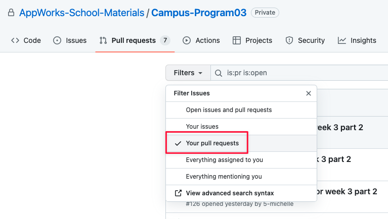

# Activity - Be a reviewer

## Learning target
1. Learn to read other developer's code through code review
2. Learn to communicate with others using code through code review

## Activity time
About 1 hours

## Activity flow
1. **Everyone is a reviewer**. Please find your partner in the discord.
2. Choose one person to start reviewing first
3. **Peer Review**, 10 minutes for each group, and arrange each other to explain the operation logic of the code( week1 + week2 ).
4. **Code Review**, 25 minutes per group to leave comments on Github.
- Please make sure **no discussion** in this stage.
- Please mention with the part which is associated with google code review guideline.
5. **Review Comment**, 5 minutes per group, discuss with the review results
6. Recap

## Materials
1. Read Code review guideline [How to do a code review on Google](https://google.github.io/eng-practices/review/reviewer/)

## Hint
1. Using *Your pull requests* to view your PRs only.

2. Remember to submit review after yor reviewing the PR.
